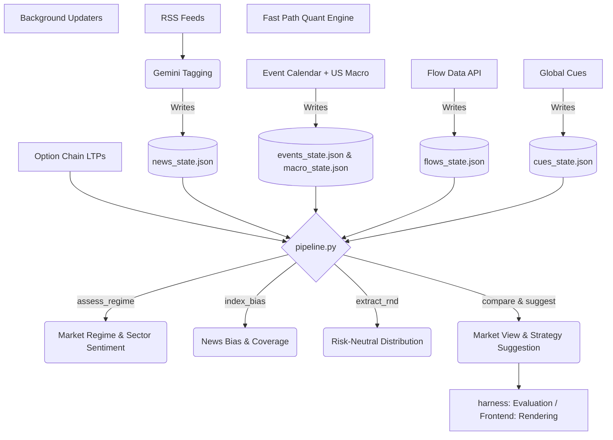

# NiftyOptions Quant Backend

## What it is
The NiftyOptions Quant engine is a decision-support signal generator. It fuses breaking news (analyzed via Gemini for sentiment and sector impact) with real-time options chain data to produce a suggested trading structure. It assesses the market regime, calculates a risk-neutral distribution (RND), and compares the news momentum against the options market's implied pricing. **Crucially, it is a RELATIVE signal**, not a calibrated probability/EV predictor, and not a standalone trade recommendation. It is designed to identify divergences where the options chain is mispricing the news momentum.

## Data-Flow Diagram

## Module Roles (`backend/quant/`)
* **`state_manager.py`**: Handles atomic reads and writes of decoupled state JSONs into the `.state/` directory.
* **`pipeline.py`**: The fast-path entry point. Takes real-time chain data, reads the JSON states, and computes the quant signal without triggering LLMs.
* **`market_regime.py`**: Assesses dominant macro regimes (e.g. geopolitics, rates) based on weighted news momentum.
* **`us_macro.py`**: Nets the explicit cross-currents of US macro forces (e.g., inflation vs oil) into an explicit two-sided tilt.
* **`sector_tree.py`**: The single source of truth for the 3-level Sector → Industry → Company hierarchy. Contains the exact Nifty 50 constituent weights and handles aliased entity resolution.
* **`sector_tagging.py`**: Extracts precise affected sectors from news headlines via LLM, and resolves direct company mentions using `sector_tree.py` to produce a 3-level attribution drill-down. Aggregates per-sector scores by source-tier-weighted **median** (was a fragile mean), flags thin reads with `low_confidence`, and emits a run-level `__audit` trail. Consumers MUST skip any `"__"`-prefixed meta key (`__drilldown`, `__audit`). See `backend/quant/SKILL.md` for detail.
* **`news_provenance.py`**: Source-trust tiering + pre-LLM hygiene layer for the news pipeline — prompt-injection/junk quarantine, relevance filter (drops foreign/crypto noise), cross-feed dedup key, and the weighted-median helper used by `sector_tagging.py`. Runs inside `get_tagged_news` before tagging.
* **`decision_engine.py`**: Calculates the top-level index bias.
* **`formulas.py`**: A formula reference layer that provides human-readable strings and tracks run-time variables for UI traceability.
* **`event_calendar.py`**: Fetches scheduled economic data (e.g., CPI, FOMC) and imposes rigid block overrides (e.g., blocking premium-selling exactly 1 day before high-impact events).
* **`flows_fetcher.py`**: Extracts domestic FPI and DII cash flows, monthly SIP inflows, and attributes index weight impacts for market breadth.
* **`global_cues.py`**: Syncs US 10Y Treasury yields and Dollar Index to provide global risk-off/risk-on context, plus Copper/Gold barometers.
* **`index_attribution.py`**: Computes index breadth via constituent analysis (e.g. tracking Top 10 heavyweights vs rest of index).
* **`rnd.py`**: Computes the Risk-Neutral Distribution from option strikes, call LTPs, and put LTPs.
* **`analytics.ts (Frontend)`**: Contains the `evaluateStrategyMetrics` generalized evaluation engine. It computes the exact bounds of P&L (max profit, max loss, breakevens) for ANY arbitrary leg structure by parsing piece-wise linear payoff curves, avoiding hardcoded shortcuts.
* **`market_view.py`**: Compares the news bias state against the options pricing state.
* **`complacency.py`**: Scores how "calm" or complacent the chain is.
* **`harness.py`**: Offline test harness for evaluating the pipeline against historical snapshots.
* **`risk_budget.py`**: Reads Volatility State (Expansion/Range) and Outlook. Outputs approved structure, directional bias, and conservative lot sizes.
* **`provenance.py`**: Implements the Transparency Layer. Provides helpers (primary, fallback, stale, etc.) to track data origin. Ensures any degraded heuristic declares itself explicitly so the UI can flag it.

## HARD RULES (Do NOT regress these invariants)
1. **RND Requires Put LTPs**: The RND extraction MUST receive both `call_ltp` and `put_ltp`. Without puts, the downside skew is completely miscalculated.
2. **Sentiment is Computed ONCE**: Sentiment is scored strictly in the backend via the Gemini prompt. The frontend must NEVER compute or override sentiment scoring client-side.
3. **Structured Sector Tagging**: Every news article MUST have a `sentiment` float and a `sectors_affected` array extracted by the LLM.
4. **Closed Vocabulary (3-Level Hierarchy)**: The sector vocabulary is closed. It must exactly match the keys defined in `sector_tree.py`. The LLM cannot invent new sector names. Furthermore, entity resolution always maps aliases to their canonical company names and propagates them up through their designated Industry and Sector. `sector_map.py` serves as a dynamic wrapper over `sector_tree.py`.
5. **Windowing & Timestamps**: News must be windowed and timestamped accurately. The pipeline applies a half-life decay to older news; missing or static timestamps break the momentum calculation.
6. **Relative Output**: The output is purely a relative suggestion based on news vs. chain. It is not a predictive probability of profit.
7. **Event Dates are Fetched**: Economic calendar dates must be fetched from the web, and fallback to `stale=True` on failure. They must NEVER be presented as confirmed hardcoded static dates.
8. **Proximity Block Override**: A high-impact scheduled event within 1 day completely blocks premium-selling strategies, REGARDLESS of how complacent or calm the option chain appears. Safety limits compose restrictively.
9. **US Macro Netting**: US data is netted into a cross-current with opposing forces shown explicitly; never collapse a two-sided macro read into a single number that hides the tension. Factor signs are directional priors, not fitted — editable config.
10. **Formula Traceability**: All critical UI numbers must be fully traceable to their math via `formulas.py`, presenting both the symbolic math and substituted values directly in the UI.
11. **Metals Barometers**: Copper (growth), Gold (fear), and Silver are used as macro barometers mapped to `global_cues.py`. Gold is NEVER linked to a direct sector; Copper/Silver directly tilt the Metals sector.
12. **Provenance Rule**: Every output must carry a metadata object containing `origin` (e.g., `PRIMARY`, `FALLBACK`, `STALE`). The UI must explicitly render the provenance status if it is not `PRIMARY`.
13. **Security Rule**: NEVER commit `GEMINI_API_KEY` or any other API keys to GitHub. Keys must ONLY be stored in `.env` (which is gitignored) or passed via environment variables.
14. **Numpy Version Compatibility**: When integrating, use a version-safe approach `_trap = getattr(np, "trapezoid", getattr(np, "trapz", None))` to avoid crashes between Numpy 1.x and 2.0.
15. **Vol Attribution**: Elevated chain IV is attributed before it's treated as sellable premium: on 0–1 DTE or with chain IV >> India VIX, the elevation is expiry/event mechanics, NOT a premium edge — flag, don't sell blindly. News-sourced VIX is interim/stale; a live quote feed supersedes it.
16. **State Cache & HMR**: The backend explicitly writes background updates to `.state/*.json`. Because Vite HMR is disabled in this IDE context (`DISABLE_HMR=true`), you MUST ensure that Vite is configured to explicitly ignore the `.state/` folder (via `watch: { ignored: ['**/.state/**'] }`), otherwise backend state updates will cause catastrophic full browser reloads, wiping out in-memory frontend data (like uploaded option chains).
## Pointers
* Exact JSON shapes and module boundary schemas: [REFERENCE.md](../../REFERENCE.md)
* Frontend rendering rules: [frontend/SKILL.md](../../frontend/SKILL.md)
* API endpoints and persistence: [backend/api/SKILL.md](../api/SKILL.md)
* Quant pipeline specifics: [backend/quant/SKILL.md](SKILL.md)
* Directional-momentum strategy suggester + walk-forward backtest (separate subsystem: index-volume dedup, cost-edge gate, MPS0 max-profit benchmark): [strategy_framework/SKILL.md](../../strategy_framework/SKILL.md)

## RND Calibration Rule
RND density must be renormalized to integrate to 1 before calculating moments. Deep-OTM strikes must be trimmed using AND logic (both call/put >= min_price) within a strict absolute band to prevent tail noise. The 1σ Expected Move must match the ATM straddle (±~30%), and the absolute skew MUST be ≤ 1.0, otherwise the RND is flagged FALLBACK and the optimizer refuses to rank.

## Environment Isolation Rule
**CRITICAL**: NEVER use `pip install` globally when working in this project. All new GenAI scripts or external tools (like CMBS Frameworks) must be run in completely isolated virtual environments to prevent catastrophic dependency conflicts (e.g., breaking `cryptography`) that crash the Uvicorn server.

## Data Connection Review Rule
**CRITICAL**: Before making any changes to data connections or credential verification pathways, you MUST read [dataconnection.md](dataconnection.md) to ensure you understand the HTTP-based validation, subprocess mapping, and session caching pathways. Do not import `kiteconnect` during validation subprocesses (use direct HTTP requests via `urllib` to bypass library dependency issues), and always use `get_customer_details` for Breeze token verification.
