# Signal Weight Agent — Independence Detection & Ensemble Weighting

## What it is

The Signal Weight Agent answers one question rigorously: **given a set of signals,
which ones carry independent information, and how much should each one weigh?** It
works for any target instrument — the NIFTY index, a constituent stock, or an index
future — because it operates on signal *scores* plus the target's *forward returns*,
not on any instrument-specific logic.

Like the News Intelligence Agent, it is a **deterministic core with an LLM layer on
top, never the other way around**: the arithmetic (correlations, IC, weight vectors)
is computed by plain numpy and is byte-reproducible; the LLM only *narrates and
recommends*, and is forbidden from inventing numbers. *Reasoning is delegated,
arithmetic is not.*

It is deliberately **not** a black-box optimizer. Every number it prints — the
correlation matrix, the families, the IC, the three weight vectors — is inspectable,
and it leads with an honest sufficiency caveat (`n_obs`), because on thin history the
correlation structure is trustworthy but the IC is not.

## Data-flow diagram

```mermaid
flowchart TD
    subgraph Core [Deterministic Core — numpy, byte-reproducible]
      SCORES[signal scores per snapshot<br/>feature store → live-eval fallback]
      FWD[target forward returns<br/>index / stock / future]
      SCORES --> COR[corr_matrix_full<br/>pairwise NaN-aware correlation]
      COR --> RED[redundancy = avg &#124;corr&#124;]
      COR --> EFF[effective-independent<br/>participation ratio]
      COR --> FAM[families<br/>connected components ≥ threshold]
      SCORES & FWD --> IC[information coefficient<br/>corr score vs fwd return]
      RED --> W1[inverse_redundancy weights]
      IC & COR --> W2[mv_ic weights: Σ⁻¹·IC]
      FAM & IC --> W3[family weights: budget per family]
    end

    W1 & W2 & W3 --> REP[[study report:<br/>independence + IC + 3 weight vectors]]
    REP --> CLI[/SignalWeightAgent.run CLI — deterministic/]
    REP --> LLM[LLM narration agent<br/>reconciles the 3, recommends ONE, caveats n_obs]
    CLI --> MD[(SignalWeightAgent/reports/*.md)]
```



## Layout

```
SignalWeightAgent/               # this agent package (separate folder, like NewsAgent)
├── SKILL.md                     # this file — the agent definition
├── README.md                    # quick usage
├── run.py                       # CLI launcher + report writer
└── reports/                     # generated study reports (*.md)

strategy_framework/analysis/     # the DETERMINISTIC CORE (lives in the framework because
├── signal_ensemble.py           #   corr_matrix_full is the shared primitive that
└── signal_study.py              #   api.signal_correlation also imports)
```

## Components

| Piece | File | Role |
|---|---|---|
| **Engine (Core)** | `strategy_framework/analysis/signal_ensemble.py` | Instrument-agnostic numpy: `corr_matrix_full` (the ONE correlation primitive, shared with `api.signal_correlation`), `redundancy`, `effective_independent`, `clusters`, `information_coefficient`, the three weight methods, `analyze_ensemble`, `format_report`. |
| **Adapter** | `strategy_framework/analysis/signal_study.py` | Pulls signal scores (feature store → live-eval fallback) and the *target* instrument's forward returns from the DB, aligns them, calls the engine. The `--target` axis is how the same signals serve index / stock / future. Roster from `signals/registry.py`. |
| **CLI + reports** | `SignalWeightAgent/run.py` | Deterministic entry point; `--report` writes a markdown report to `SignalWeightAgent/reports/`. |
| **Narration agent** | `.agents/signal-weight-analyst.md` | The LLM layer: runs the CLI, reconciles the three weight vectors, recommends one, and never invents a number. (Copy to `.claude/agents/` to activate as a subagent.) |

## Hard rules (do NOT regress)

1. **Numbers come from the Core, not the LLM.** The LLM narrates and recommends; every
   correlation / IC / weight is computed deterministically. An LLM that emits an
   un-sourced number is a bug.
2. **No lookahead.** Scores and forward returns are read as-of each snapshot; the
   forward return uses only bars at/after the snapshot (mirrors the Desk's as-of test).
3. **PRIOR until calibrated.** Below ~60 sessions every number is *descriptive only*
   (D-MA-04). The report leads with `n_obs` and says so.
4. **Correlation > IC on thin data.** Score co-movement stabilizes with far less data
   than predictive edge; when history is short, trust the families, not the IC signs.
5. **NO_DATA is excluded, never faked.** A signal with no data is reported as excluded,
   not silently scored 0 (mirrors the news engine's quarantine discipline).
6. **Single roster source.** The signal list comes from `strategy_framework/signals/registry.py`
   (HARD RULE 13) — the agent never hardcodes its own list, so a new signal is picked
   up automatically.
7. **Weights are importance, not direction.** Every proposed weight is ≥ 0 and the
   vector sums to 1; the sign lives in each signal's score.
8. **Show all three, recommend one.** Inverse-redundancy (diversification-only),
   Σ⁻¹·IC (skill + independence), family (robust to correlation) are always printed
   side by side so the trade-offs are visible before a choice is made.

## Validation (how you'd know it works)

* **Engine self-test** — `python -m strategy_framework.analysis.signal_ensemble` runs
  a synthetic case with a known structure (two near-identical signals must collapse
  into one family; the skill-less-but-independent signal must be down-weighted by
  `mv_ic` yet over-weighted by `inverse_redundancy`).
* **Shared-primitive parity** — `api.signal_correlation` routes through this engine's
  `corr_matrix_full`; its output hash is unchanged (no duplicate correlation code).
* **Framework suite** — `python -m pytest strategy_framework/tests/ -q` (26 tests).
* **Instrument-agnostic** — `--target NIFTY` vs `--target <stock>` vs `--target
  NIFTY_FUT_1` all run and reshape the families against that instrument's returns.

## How to run

```
# deterministic core (no LLM) — run from the repo root
python -m SignalWeightAgent.run --target NIFTY --horizon 60m
python -m SignalWeightAgent.run --target RELIANCE --window-days 60
python -m SignalWeightAgent.run --target NIFTY_FUT_1 --report      # writes reports/*.md

# LLM narration: activate .agents/signal-weight-analyst.md, then ask the agent
#   "run a signal study on NIFTY and recommend weights"
```

## Relationship to the existing project

The parent `strategy_framework/` computes the signals (`signals/`) and their blend
(`strategy/regime.py`, weights in `config/settings.py` derived from
`signals/registry.py`). This agent is the **layer that decides those weights honestly**:
it measures whether the signals are independent and how predictive they are, and
proposes the weight vector the blend should use — closing the loop between the signals
that exist and the weights they're given. Its deterministic core lives in
`strategy_framework/analysis/` (so the correlation primitive can be shared with the
API); this folder is the agent packaging + entry point + reports, kept separate like
`newsindex/NewsAgent/`.
