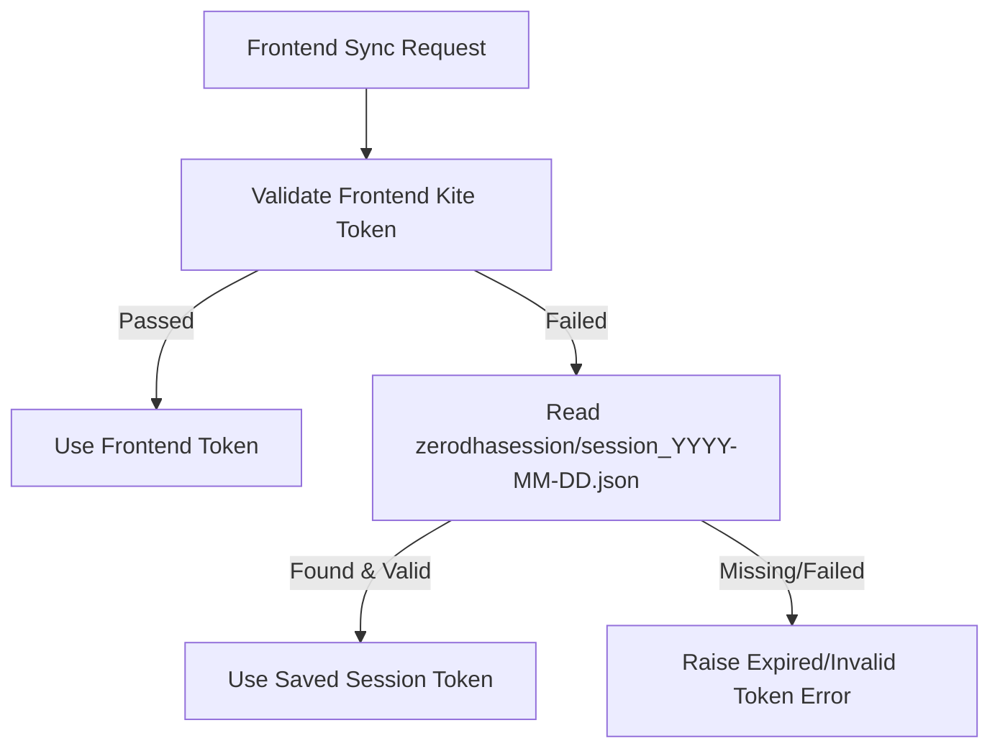
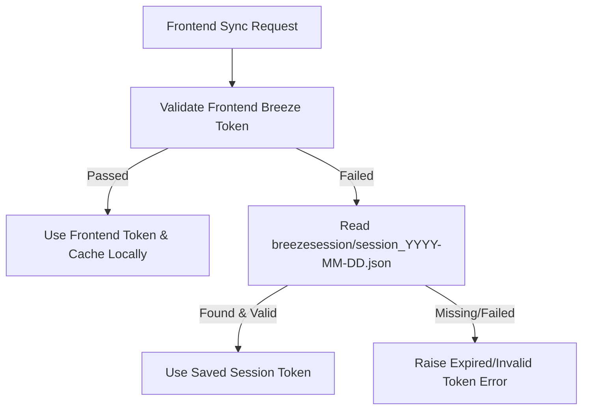

# Data Connection & Session Validation Architecture

This document outlines the connection validation, error profiles, and architectural guardrails implemented for the ICICI Breeze and Zerodha Kite APIs.

---

## 1. Architecture Flow

### ICICI Breeze validation
*   **Method**: Executed via a Python subprocess running in the `./breeze_env` virtual environment.
*   **Verification Call**: Calls `breeze.get_customer_details(api_session=token)`.
*   **Resolution**: 
    *   *Correction*: Upgraded from the singular `get_demat_holding()` (which is not present/valid in the SDK) to the correct session validation method `get_customer_details()`.

### Zerodha Kite validation
*   **Method**: Standard Python HTTP Request (`urllib.request`) executed inside the main Python process.
*   **Verification Call**: `GET https://api.kite.trade/user/profile` with header `Authorization: token {api_key}:{access_token}`.
*   **Reasoning**: Spawning a subprocess that imports `kiteconnect` requires importing `twisted` and `cryptography` rust bindings, which are prone to dynamic linking/import issues on macOS (e.g. `ImportError: cannot import name 'asn1' from 'cryptography.hazmat'`). Performing a pure HTTP call completely bypasses the library load path, making it extremely robust.

### Upstox validation & session pathway
*   **Method**: Standard Python HTTP Request (`requests.get`) executed inside the main Python process.
*   **Verification Call**: Authenticated requests using the `Authorization: Bearer {UPSTOX_ACCESS_TOKEN}` header.
*   **Credential Storage**: Managed via `upstox_auth.py`'s `get_upstox_token()`, which prioritizes `UPSTOX_ACCESS_TOKEN` in the environment variables and falls back to parsing the repo-root `.env` file directly. Unlike Breeze/Kite, it utilizes a persistent developer API access token rather than requiring daily interactive frontend authentication.

---

## 2. Guardrails & Dual-Source Lookup

When clicking the **Sync** button in the UI, validation runs a dual-source lookup for both feeds:

### Zerodha Kite Validation Lookup

1.  **Source 1 (Frontend)**: Validates the token passed directly from the browser's input box.
2.  **Source 2 (Saved Session Fallback)**: If the frontend token is expired, invalid, or undefined, the backend automatically reads the latest active session file from `zerodhasession/session_<YYYY-MM-DD>.json`. If this token passes validation, it automatically swaps in the active token.

### ICICI Breeze Validation Lookup

1.  **Source 1 (Frontend)**: Validates the token passed directly from the browser's input box. On a successful validation pass, the backend automatically caches this token locally under `breezesession/session_<YYYY-MM-DD>.json`.
2.  **Source 2 (Saved Session Fallback)**: If the frontend token is expired or invalid, the backend automatically reads the latest active session file from `breezesession/session_<YYYY-MM-DD>.json`. If this token passes validation, it automatically swaps in the active token.

---

## 3. Troubleshooting Standard Errors

| Error Message | Meaning / Cause | Resolution |
| :--- | :--- | :--- |
| **`ImportError: cannot import name 'asn1'...`** | Dynamic linking/binding conflict with the compiled Rust/cryptography bindings in the virtual environment. | Fixed by validating the token via a direct, standard library HTTP call rather than loading the full library stack. |
| **`Incorrect api_key or access_token`** | The token does not match the registered API App Key, or the token is expired/invalid. | Generate a new session key using the correct API Key. Check the saved JSON session file. |
| **`Breeze connection test failed`** | Typically caused by a mismatch in the API key / API secret, or invoking invalid SDK methods (e.g. `get_demat_holding`). | Corrected validation call to `get_customer_details` which is the standard SDK validation method. |
