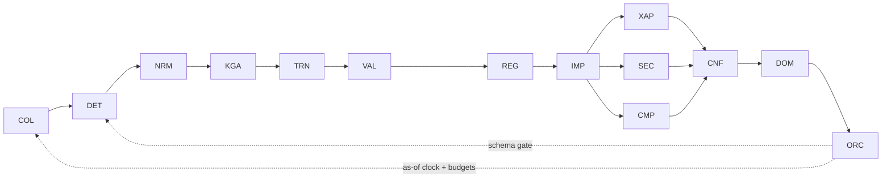

# AGENTS — sub-agent specifications

Each agent below is an **LLM agent with a bounded toolset**, orchestrated per
[ARCHITECTURE.md](ARCHITECTURE.md). Every spec follows the same template:

> **Mission** · **Consumes** · **Tools** · **Produces** · **Prompt contract** · **Guardrails**

Two conventions throughout:
- **Core-call** = a typed request to the Deterministic Core (numbers only).
- Any number an agent emits is either a Core-call result or a value explicitly tagged
  `hypothesis` (never a committed number).

---

## 0. Orchestrator (deterministic controller — not an LLM)

**Mission.** Own the as-of clock, run the pipeline DAG, enforce budgets, validate every
message against its schema, assemble the MIO, handle retries/fallbacks/degradation.

**Consumes.** Source triggers, heartbeat ticks. **Produces.** Validated MIOs on the bus.

**Guardrails.** Blocks (never coerces) schema-invalid messages. Falls back to the
Deterministic Core's rule path on LLM failure and tags the MIO `degraded: true`. Enforces
max LLM calls / tokens / wall-clock per event.

---

## 1. Collector Agent

**Mission.** Continuously poll every structured and unstructured source, normalize to a
common item envelope, and stamp provenance + timestamp. It reaches sources standard agents
can't (paywalled wires, JS-heavy pages, forums) via web-data tooling.

**Consumes.** Source registry (see [DATA_SOURCES.md](DATA_SOURCES.md)).

**Tools.** `web.fetch`, `web.search`, `feed.poll`, `filing.fetch` (SEC/NSE/BSE),
`market_data.quote` (oil/gold/copper/yields/USD/VIX/FX/indices/options), `altdata.pull`
(shipping/satellite/weather/social/supply-chain/AI-trends).

**Produces.** `RawItem { id, source, source_tier, url, ts_event, ts_ingest, title, body,
lang, asset_hints[] }`.

**Prompt contract.** *"Given this fetched content, extract the market-relevant claim(s),
the entities named, and the event time. Do not interpret significance — only structure."*

**Guardrails.** `ts_event ≤ as_of`. Deduplicate on URL/hash. Preserve source tier for later
reliability weighting. Never fabricate a timestamp — if unknown, tag `ts_estimated`.

---

## 2. Event Detection Agent

**Mission.** Decide whether an item is **capable of changing market expectations**. Most news
is not. This is a triage gate, deliberately cheap, tuned for recall (don't miss a real
catalyst) with the Normalization/Impact stages downstream to control precision.

**Consumes.** `RawItem`.

**Tools.** `core.event_taxonomy` (Core-call: is this class historically market-moving?),
`kg.lookup_entity` (is a tracked entity involved?).

**Produces.** `EventCandidate { raw_item_id, is_market_moving, event_class, novelty,
surprise_hint }` or a `Discard { reason }`.

**Event classes.**
- *Economic* — CPI, GDP, PMI, payrolls, retail sales.
- *Corporate* — earnings surprise, guidance revision, CEO change, acquisition, buyback.
- *Policy* — rate decision, tariff, tax change, export restriction.
- *Geopolitical* — war, sanctions, elections, trade agreement.
- *Market* — oil spike, bond-yield shock, currency intervention.

**Prompt contract.** *"Classify this item into one event class or NONE. Judge whether it can
move expectations for any tracked asset/sector. Rate novelty (is this new information?) and
surprise vs the known consensus. Output structured; do not estimate magnitude."*

**Guardrails.** Novelty check against the Event store — a re-report of a known event is a
merge candidate, not a new event. Surprise is *hint-only*; the calibrated surprise number
comes from the Core at the Impact stage.

---

## 3. Normalization Agent

**Mission.** Collapse many headlines describing the **same** event into **one canonical
event node**. Three wires on Hormuz → one "Middle East Supply Shock".

**Consumes.** `EventCandidate` + recent candidate window.

**Tools.** `kg.find_similar_events` (embedding + entity-overlap search), `core.event_key`
(deterministic dedup key from entities + class + time bucket).

**Produces.** `CanonicalEvent { event_id, canonical_label, class, member_items[],
first_seen, entities[], dedup_key }` — either newly minted or an existing event **updated**
with new members.

**Example.**
```
Reuters  "Iran closes Strait of Hormuz"
Bloomberg "Oil jumps after Hormuz disruption"     ──►  Event: Middle East Supply Shock
CNBC     "Brent rallies on Middle East tensions"
```

**Prompt contract.** *"Given this candidate and these recent events, decide: is this the same
underlying event as one already in the graph? If yes, return its event_id and what new
information this item adds. If no, propose a canonical label that names the event, not the
headline."*

**Guardrails.** Canonical labels name the *event* ("Middle East Supply Shock"), never a
single outlet's framing. Merges must preserve every member item's provenance for source
weighting. Time-bucket the dedup key so a genuinely new flare-up weeks later is a new event.

---

## 4. Knowledge Graph Agent

**Mission.** The heart of the system. Upsert entities and, crucially, the **causal edges**
between them. Store relationships, not news. Every canonical event updates the graph.

**Consumes.** `CanonicalEvent`.

**Tools.** `kg.upsert_node`, `kg.upsert_edge`, `kg.get_neighborhood`, `core.edge_prior`
(Core-call: prior weight + sign for a proposed edge, regime-conditioned).

**Produces.** `GraphDelta { added_nodes[], added_edges[], updated_edges[] }`.

**What it stores** (full ontology in [KNOWLEDGE_GRAPH.md](KNOWLEDGE_GRAPH.md)):
```
Iran Attack → Oil → Inflation → RBI → Bond Yield → Banks → Nifty
SOX Rally → AI Infra → Enterprise Capex → {Banks, Insurance} ; AI Substitution → IT Services
```

**Prompt contract.** *"Given this canonical event and its graph neighborhood, propose the
nodes and directed causal edges it implies. For each edge state the mechanism in one clause.
Request the prior weight and sign for each edge from the Core; do not assign weights
yourself."*

**Guardrails.** Edges are directed and carry a *mechanism* string. No edge is committed with
an LLM-invented weight — the weight is a Core-call. New edge *types* are proposed, never
silently created — they queue for calibration and ship tagged `PRIOR`.

---

## 5. Transmission Agent

**Mission.** The most important capability. Never stop at "Oil +5%." Ask **why**, classify the
**shock type**, and **score each propagation path**. Different transmission → different
implications.

**Consumes.** `CanonicalEvent` + graph neighborhood.

**Tools.** `core.transmission_score` (Core-call: score a path), `core.shock_classifier`
(supply / demand / inventory / speculation / policy), `market_data.quote`.

**Produces.** `Transmission { shock_type, paths[ {chain[], score, mechanism, sign} ] }`.

**The question it always asks.**
```
Oil +5%  →  why?  →  Supply shock? Demand shock? Inventory? Speculation? Policy?
                     (each path has different downstream implications)
```
**Example path.**
```
Oil → Inflation → Bond Yield → Financial Conditions → Banks → Real Estate → Auto → Consumption
```

**Prompt contract.** *"Determine why this move happened by classifying the shock type from the
evidence. Enumerate the plausible transmission paths through the graph. For each path,
request a transmission score from the Core and state the economic mechanism. Rank paths by
score."*

**Guardrails.** Shock type is evidence-based, not assumed (a supply-driven oil move and a
demand-driven one propagate oppositely to energy demand names). Path scores are Core-calls.
Paths with no Core-scoreable mechanism are dropped, not guessed.

---

## 6. Validation Agent (Relationship Validation)

**Mission.** Institutional desks never assume textbook relationships always hold. Compare the
**expected** move to the **observed** tape and record **confirm** or **override + reason** —
never "rule failed."

**Consumes.** `Transmission` + live market data.

**Tools.** `core.expected_vs_observed` (Core-call), `market_data.quote`, `kg.get_edge_history`.

**Produces.** `RelationshipStatus { edge_id, expected_sign, observed_sign, status:
CONFIRMED|OVERRIDDEN|WEAKENED, reason, evidence[] }`.

**Example.**
```
Expected:  Oil ↑ → ONGC ↑, BPCL ↓
Observed:  ONGC ↓, BPCL ↑
Verdict:   OVERRIDDEN — reasons: government pricing, profit-taking, strong GRM, broad risk-on
```

**Prompt contract.** *"The Core reports expected sign X and observed sign Y for this edge. If
they disagree, do not conclude the relationship is invalid. Identify the most likely
overriding driver(s) — government intervention, positioning/profit-taking, a stronger
concurrent driver, or a regime change — and state the reason with evidence."*

**Guardrails.** The word "failed" is banned in output; the schema requires a `reason` on every
override. Overrides update the edge's track-record (hit-rate) in the Core, feeding future
confidence. Persistent overrides escalate to the Regime Agent as a possible regime shift.

---

## 7. Regime Agent (Market Regime Detection)

**Mission.** Relationships change. Detect **which regime is active** so edges are conditioned
correctly. The same SOX rally means IT↑ under *AI-complement* and IT↓ under *AI-substitution*.

**Consumes.** `RelationshipStatus` stream, cross-asset tape, override history.

**Tools.** `core.regime_blend` (Core-call), `core.regime_detect`, `market_data.quote`.

**Produces.** `RegimeState { active[ {regime, confidence, since} ], conditioning_overrides[] }`.

**Regime set.** Inflation, Deflation, Risk-On, Risk-Off, Liquidity, Credit, Recession,
Commodity Supercycle, AI-Complement, AI-Substitution (extensible).

**Prompt contract.** *"Given recent relationship confirmations/overrides and the cross-asset
tape, request the Core's regime blend. Judge which regimes are active now and how they
re-sign or re-weight edges. Flag any regime transition in progress with its evidence."*

**Guardrails.** Regime is a *conditioning layer* on edges, not a free label — every active
regime must name the edges it re-signs. Transitions are probabilistic and tagged `PRIOR`
until confirmed over multiple sessions. The regime state is versioned so downstream MIOs can
cite which regime produced them.

---

## 8. Impact Engine

**Mission.** Estimate magnitude **separately by horizon**. Institutional research never blends
a two-hour reaction with a two-year structural shift.

**Consumes.** `Transmission` + `RegimeState`.

**Tools.** `core.impact_estimate` (Core-call, per horizon), `core.materiality_floor`.

**Produces.** `Impact { immediate, short, medium, structural }` where each is
`{ direction, magnitude, unit, confidence_hint }`.

**Horizons.**
| Horizon | Window |
|---|---|
| Immediate | minutes–hours |
| Short | 1–5 days |
| Medium | weeks |
| Structural | months–years |

**Prompt contract.** *"For each of the four horizons, request the Core's impact estimate and
describe what drives it at that horizon specifically. Do not average across horizons; a large
immediate move may fully reverse structurally, and that must be visible."*

**Guardrails.** Four distinct fields, never collapsed. An event below the materiality floor at
*every* horizon is dropped here. Magnitudes are Core-calls; the LLM supplies the mechanism
narrative per horizon.

---

## 9. Cross-Asset Propagation Agent

**Mission.** Walk every event through the financial system so a shock in one asset surfaces its
effects everywhere it transmits.

**Consumes.** `Impact` + graph.

**Tools.** `core.transmission_score`, `kg.get_neighborhood`, `market_data.quote`.

**Produces.** `CrossAsset { chains[ {chain[], per_hop_sign, per_hop_score} ] }`.

**Examples.**
```
Oil → Inflation → RBI → Yield Curve → Banks → NBFC → Housing → Consumption → FMCG
US Yield → Dollar → USDINR → FII flows → Banks → Nifty
```

**Prompt contract.** *"Propagate this impact through the cross-asset graph. For each hop
request the Core's transmission score and sign under the active regime. Stop a chain when the
score decays below threshold. Return the full chains, not just endpoints."*

**Guardrails.** Chains terminate on score decay, not arbitrarily. Every hop is regime-
conditioned via the Regime Agent's state. No hop sign is LLM-invented.

---

## 10. Sector Intelligence Agent

**Mission.** Never stop at "Oil → Energy." Decompose to **sub-sectors**, each with its **own
transmission score**.

**Consumes.** `CrossAsset` + `Impact`.

**Tools.** `core.sector_factor_model` (Core-call), `core.sector_transmission_score`.

**Produces.** `SectorScores { sector → {direction, score, mechanism, horizon_bias} }`.

**Example.**
```
Oil → { Upstream, Downstream, Airlines, Paint, Chemicals, Tyres, Logistics, Power }
AI  → { Semis, Power, Telecom, Data Centres, IT Services, Banks, Insurance, Manufacturing, Healthcare }
```

**Prompt contract.** *"Decompose the affected sector into its economically distinct
sub-sectors. Request a transmission score for each from the Core's sector factor model.
Explain why upstream and downstream diverge; do not assign one score to a whole sector."*

**Guardrails.** Sub-sector granularity is mandatory — "Energy" alone is rejected. Each score is
a Core-call from the sector factor model. Divergent signs within a parent sector (upstream vs
downstream on an oil move) must be explicit.

---

## 11. Company Intelligence Agent

**Mission.** Map each event to specific companies through a full **exposure vector**, and pull
**historical analogues**.

**Consumes.** `SectorScores` + `CanonicalEvent`.

**Tools.** `core.company_exposure` (Core-call: the exposure vector), `core.historical_analogues`
(event-memory lookup), `kg.get_entity`.

**Produces.** `CompanyScores { company → { direction, score, exposure_vector, analogues[] } }`.

**Exposure vector fields.**
```
Company → Sector → Industry → Nifty weight → Revenue exposure → FX exposure →
Commodity exposure → Interest-rate sensitivity → Supply chain → Competitors →
Historical similar events
```

**Prompt contract.** *"For each candidate company, request its exposure vector from the Core.
Combine the exposures with the event's transmission to produce a directional score. Retrieve
the closest historical analogues and note how the company reacted then."*

**Guardrails.** Exposure numbers are Core-calls, not recalled from the LLM's training. Analogues
must be real records from the event-memory store, cited by date. Nifty weight ties the company
score back to index impact.

---

## 12. Confidence Agent

**Mission.** Replace bare verdicts with **quantified confidence**. Every conclusion carries a
triple: economic rationale, historical reliability, and today's applicability.

**Consumes.** All L3 outputs.

**Tools.** `core.confidence` (Core-call combining the three components), `core.reliability`
(historical hit-rate for the edge/rule), `core.today_applicability`.

**Produces.** `Confidence { econ_rationale_stars, historical_reliability_pct, today_confidence_pct }`.

**Example.**
```
Instead of:  "Bullish"
Emit:        "Bullish — Econ rationale ★★★★★ · Historical reliability 61% · Today 82%"
```

**Prompt contract.** *"Assess the strength of the economic rationale (stars). Request the
historical reliability of this relationship from the Core. Request today's applicability —
does the current environment suit this rule right now? Combine into the confidence triple;
do not output a direction without it."*

**Guardrails.** A five-star rule on a quiet day is still *low today* — the today-component is
independent of the standing reliability (mirrors the "Today applicability" column already in
`market_scan.py`). Reliability below 60 sessions is tagged `PRIOR`/descriptive. Direction
without confidence is schema-rejected.

---

## 13. Driver-Dominance Agent

**Mission.** Markets rarely move on one driver. Decompose the day's move across drivers so
downstream agents know **what actually drove the tape**.

**Consumes.** The full event set for the session + tape.

**Tools.** `core.dominance_decomposition` (Core-call), `market_data.quote`.

**Produces.** `Dominance { driver → share }` summing to ≈ 1.0, plus `dominant_driver` and
`dominant_driver_score`.

**Example.**
```
Corporate Earnings 25% · AI 22% · FII 18% · India CPI 15% · Oil 12% · VIX 8%
→ dominant_driver = Corporate Earnings, score = 0.25
```

**Prompt contract.** *"Request the Core's driver-dominance decomposition for this session.
Sanity-check it against the events detected today and the observed tape. Name the dominant
driver and explain, in one line, why it led price discovery today."*

**Guardrails.** Shares are a Core-call and must sum to ≈ 1.0 (Orchestrator asserts). On a
single-catalyst day the vector must concentrate; a diffuse vector on an obviously
one-driver day is a flagged inconsistency.

---

## Agent budget & interaction summary



Every arrow is a typed, schema-validated message. The Orchestrator meters LLM calls per
event so a burst of news cannot exhaust the budget, and degrades gracefully to the
Deterministic Core's rule path when any LLM agent fails.
