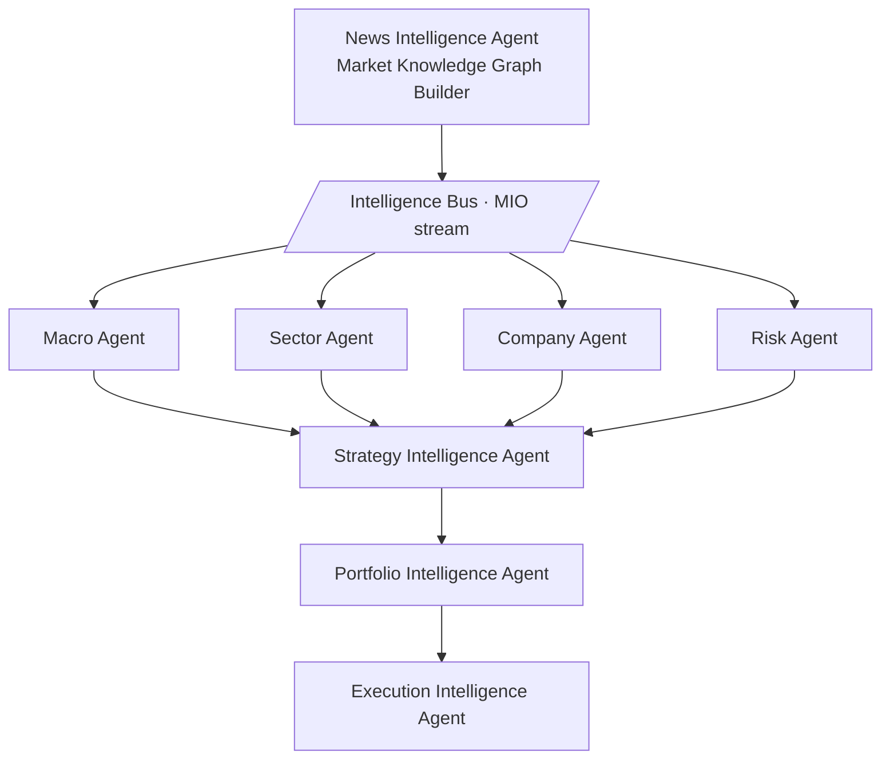
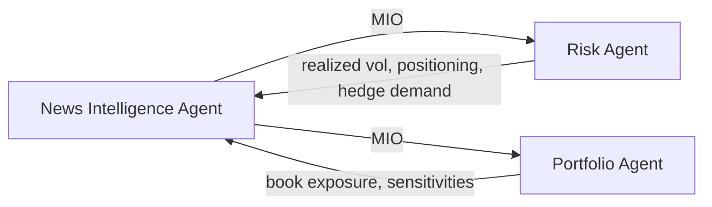

# AGENT_INTERACTION — downstream contracts

The News Intelligence Agent sits at the **top of the stack**. It publishes MIOs
([MARKET_INTELLIGENCE_OBJECT.md](MARKET_INTELLIGENCE_OBJECT.md)) onto the **Intelligence
Bus**; downstream analytical and trading agents subscribe and act. They never re-read the
news — the MIO is the interface.

## 1. The bus contract

* **Transport-agnostic.** Queue, topic, or table — the contract is the *message*, an MIO that
  validates against `schemas/mio.schema.json`.
* **Filterable.** Subscribers filter by any MIO field: `class`, `regime.primary`,
  `affected_sectors`, `confidence.today_confidence ≥ θ`, `driver_dominance.dominant_driver`.
* **Idempotent & versioned.** Each MIO carries `mio_id`, `graph_version`, `regime_version`.
  Re-published updates (heartbeat re-scores) supersede by `mio_id` lineage, not duplicate.
* **As-of honored downstream.** An MIO's `as_of` is authoritative; downstream agents must not
  act on an MIO with future data relative to their own decision clock.

## 2. What each downstream agent consumes and produces

| Downstream agent | Reads from MIO | Produces | Typical filter |
|---|---|---|---|
| **Macro Agent** | `regime`, `theme`, `transmission`, `expected_direction`, `impact` | macro stance (rates/FX/duration view), regime call | `class ∈ {Economic, Policy, Market}` |
| **Sector Agent** | `affected_sectors`, `transmission`, `regime` | sector over/underweights with confidence | `affected_sectors` non-empty |
| **Company Agent** | `affected_companies`, `exposure_vector`, `analogues` | single-name conviction + catalyst calendar | `affected_companies` contains watchlist |
| **Risk Agent** | `impact` (all horizons), `driver_dominance`, `regime`, `confidence` | exposure/concentration limits, hedging triggers, scenario stress | `today_confidence`, tail-risk classes |
| **Strategy Intelligence Agent** | the fused view from Macro/Sector/Company/Risk | tradeable strategy hypotheses | — |
| **Portfolio Intelligence Agent** | strategy hypotheses + Risk limits | position construction, sizing | — |
| **Execution Intelligence Agent** | portfolio targets | orders, timing, cost-aware execution | — |

## 3. How the MIO fields map to decisions

* **`regime` + `transmission`** → the Macro Agent's *directional thesis* (which way, through
  what channel).
* **`confidence` triple** → *sizing input* everywhere: `econ_rationale_stars` and
  `historical_reliability` gate whether a call is actioned; `today_confidence` scales
  conviction *for today's environment*.
* **`impact` (four horizons)** → different agents consume different horizons: Execution cares
  about `immediate`; Portfolio about `short`/`medium`; the Macro/allocation view about
  `structural`. Because they are separate fields, no agent is misled by a blended number.
* **`driver_dominance`** → the Risk Agent's *concentration lens*: if one driver dominates
  (e.g. `US CPI 0.34`), risk is concentrated on that driver and hedges should target it.
* **`validation` overrides** → a *regime-change early warning* for the Macro and Risk agents.

## 4. Feedback loop (why it's a system, not a pipeline)

Downstream agents feed signals **back** to the News Intelligence Agent, closing the loop:

* The **Risk Agent** returns realized outcomes → the Validation Agent uses them to update edge
  track-records (calibration).
* The **Portfolio Agent** returns current book exposures → the Company/Sector agents weight
  relevance (an event on a held name matters more).

This feedback is what turns priors into calibrated edges over ≥ 60 sessions — the mechanism by
which `PRIOR` weights graduate to `CALIBRATED`.

## 5. Contract stability

The MIO schema is the platform's **stable interface**. Internal agents (detection,
transmission, regime, etc.) can be re-implemented, re-prompted, or swapped for better models
without breaking downstream consumers, as long as the emitted MIO still validates. This
decoupling is the point of standardizing on one object.
