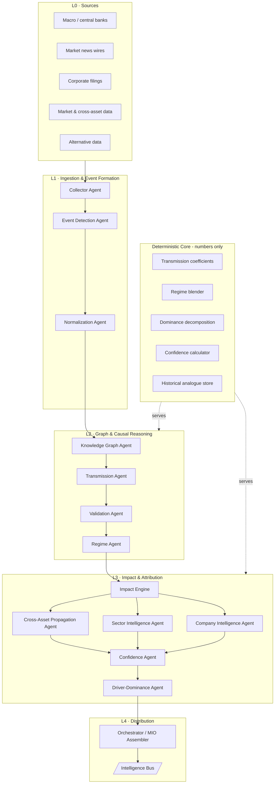
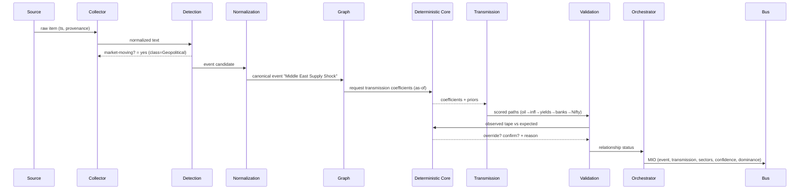

# ARCHITECTURE — News Intelligence Agent

Full LLM multi-agent architecture over a deterministic numerical core. This document
describes the *topology*, the *pipeline*, the *orchestration*, the *state stores*, and the
*Deterministic Core* boundary. Per-agent detail is in [AGENTS.md](AGENTS.md); the graph
model is in [KNOWLEDGE_GRAPH.md](KNOWLEDGE_GRAPH.md); the output object is in
[MARKET_INTELLIGENCE_OBJECT.md](MARKET_INTELLIGENCE_OBJECT.md).

## 1. Design principles

1. **Reasoning is delegated; arithmetic is not.** LLM agents interpret text, resolve
   entities, choose transmission channels, and self-critique. Every committed *number*
   (coefficient, transmission score, regime weight, dominance share, confidence) is produced
   by the Deterministic Core. An LLM may only *propose* a number as a tagged hypothesis.
2. **The graph is the product, the report is a view.** The system's primary artifact is a
   continuously-updated causal knowledge graph. Daily notes, dashboards, and MIOs are
   *projections* of the graph at an as-of timestamp.
3. **Everything is as-of.** A single monotonic decision clock, owned by the Orchestrator,
   gates every read. No agent may read a record stamped after the clock.
4. **Every edge is a hypothesis with a track record.** Relationships are not asserted as
   truth; they carry a prior, an observed hit-rate, and a regime condition.
5. **Contracts over conversations.** Agents communicate via typed messages on a bus, not
   free-form chat. Each message validates against a schema before it is accepted.

## 2. Layered topology

## 3. The pipeline, stage by stage

Each raw item flows through a fixed pipeline. Any stage can **drop** an item (with a logged
reason) so downstream stages never see noise.

| # | Stage | Agent | In → Out | Drop condition |
|---|---|---|---|---|
| 1 | Collect | Collector | source poll → raw item (+ provenance, ts) | fetch failure / duplicate URL |
| 2 | Detect | Event Detection | raw item → `is_market_moving` + event class | not capable of moving expectations |
| 3 | Normalize | Normalization | items → one canonical event | folds into an existing event (merge, not drop) |
| 4 | Graph upsert | Knowledge Graph | canonical event → graph delta | — |
| 5 | Transmit | Transmission | event → shock type + scored paths | no plausible transmission path |
| 6 | Validate | Validation | expected vs observed tape → status | — |
| 7 | Regime | Regime | active-regime set → edge conditioning | — |
| 8 | Impact | Impact Engine | horizoned magnitudes | below materiality floor at every horizon |
| 9 | Propagate | Cross-Asset / Sector / Company | entity-level effect vectors | — |
| 10 | Score | Confidence + Dominance | confidence triple + dominance vector | — |
| 11 | Assemble | Orchestrator | → validated MIO onto the bus | schema-invalid (blocked, logged) |

### Sequence view (one event's lifecycle)

## 4. Orchestration model

The **Orchestrator** is a deterministic controller, not an LLM. It:

* owns the single **as-of clock** and passes it into every agent call;
* runs the pipeline as a DAG, fanning out L3 propagation agents (Cross-Asset / Sector /
  Company) in parallel and joining at the Confidence Agent;
* enforces **budgets** — max LLM calls per event, max tokens per agent, wall-clock ceiling —
  so a noisy news minute cannot exhaust the system;
* performs **schema validation** at every hand-off and blocks (never silently coerces)
  invalid messages;
* handles **retries and fallbacks** — if an LLM agent fails or returns low self-confidence,
  the Orchestrator can retry once, then fall back to the Deterministic Core's rule-based
  path (the current `market_scan.py` logic) and tag the MIO `degraded: true`.

Two cadences run concurrently:

* **Event-driven** — a new market-moving event triggers the full pipeline immediately.
* **Heartbeat** (e.g. every N minutes) — re-scores open events against the live tape so the
  Validation and Regime agents can flip a relationship intraday, and refreshes
  driver-dominance for the "what moved the market" read.

## 5. State stores

| Store | Holds | Analogue in `newsindex/` |
|---|---|---|
| **Article/Item store** | raw items + provenance + ts | `articles.db` |
| **Event store** | canonical events, dedup keys, class | `events.db` |
| **Knowledge Graph store** | nodes, edges, edge history, regime conditioning | *new* (graph DB / typed tables) |
| **Relationship track-record** | per-edge prior, hit-rate, session count | extends `calibrate.py` output |
| **MIO log** | every emitted MIO, immutable, replayable | `reports/` (structured) |
| **Regime state** | active regimes + confidence, per horizon | *new* |

The Knowledge Graph store is the one genuinely new component; everything else extends
structures the project already has.

## 6. Deterministic Core boundary

The Core exposes a **numbers-only API** to the LLM agents. It never sees free text; it
receives typed requests and returns typed numbers with tags. Mapping to existing code:

| Core capability | LLM agent that calls it | Existing `market_scan.py` primitive |
|---|---|---|
| Transmission coefficients / expected move | Transmission | `build_causal_engine`, `build_transmission_map` |
| Regime blend & active-regime detection | Regime | `detect_ai_regime`, `market_regime`, `build_oil_regime` |
| Expected-vs-observed override analysis | Validation | `_override_analysis`, `reconcile_oil_proxies` |
| Sector transmission scores | Sector Intelligence | `build_sector_factor_model`, `build_sector_impact` |
| Cause→effect reliability | Confidence | `build_cause_effect_scorecard`, `calibrate.py` |
| Driver-dominance decomposition | Driver-Dominance | `_driver_strength`, dominance logic in `build_causal_engine` |
| Historical analogues | Company / Confidence | `build_events.py` event memory |

**Rule:** if a number can be produced by one of these primitives, the LLM must request it
from the Core rather than generating it. The LLM's job is to decide *which* primitive
applies, with *what* inputs, and to *narrate and self-critique* the result.

## 7. Failure, degradation, and trust

* **LLM disagreement with the tape** → Validation Agent defers to the Core's observed data;
  the LLM's narrative is annotated, not trusted over the number.
* **Core unavailable** → pipeline halts numeric commits; only qualitative event detection and
  graph-structure updates proceed, all tagged `numbers_pending`.
* **Low-confidence event** → still emitted, but flagged; downstream agents may filter by
  `today_confidence` threshold.
* **Every MIO is reproducible** — given the same as-of inputs and Core version, the committed
  numbers are deterministic; only the narrative text may vary.

## 8. What makes this institutional (vs a news bot)

A news bot ends at stage 2 (detect) and emits a sentiment label. This architecture treats
detection as the *cheapest* step and spends its budget on stages 5–10: **why** the event
matters, **how** it propagates, **which** relationships are live **today**, and **which**
driver dominated price discovery — each as a typed, quantified, explainable field on a
standardized object that a trading desk's downstream agents can act on without re-reading
the news.
