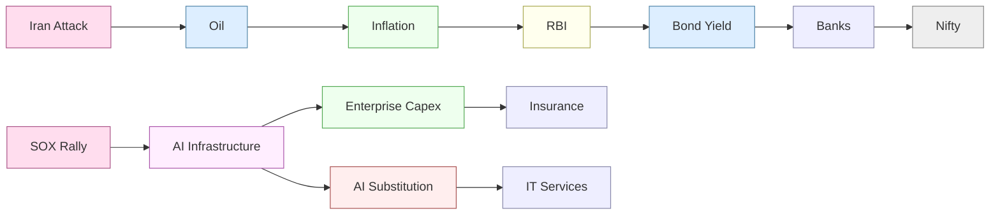
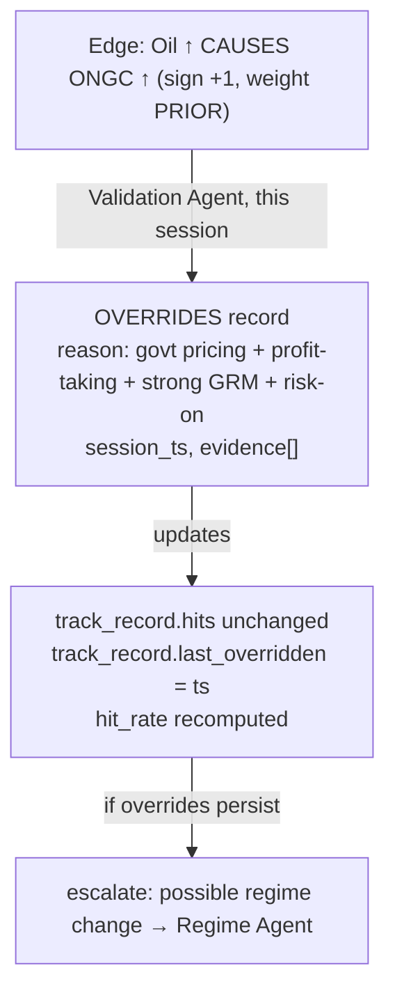

# KNOWLEDGE_GRAPH — ontology & model

The knowledge graph is the system's primary artifact. It stores **relationships, not news**.
Events update the graph; the daily note and the MIO are projections of the graph at an as-of
timestamp. This document defines the ontology (node types, edge types, properties), how
overrides and regimes are modeled, and how the graph is queried and versioned.

## 1. Why a graph

A sentiment engine stores `article → score`. A knowledge graph stores the *causal structure
of the market* so that any new event can be propagated through relationships that already
exist and have a track record. The graph is what lets the system answer *why*, *how far*, and
*which relationships are live today* — not just *what happened*.



## 2. Node types

| Node type | Examples | Key properties |
|---|---|---|
| **Event** | Middle East Supply Shock, US CPI beat | `event_id, class, canonical_label, first_seen, member_items[]` |
| **Asset** | Oil, Gold, Copper, USDINR, 10Y yield, VIX | `symbol, asset_class, last_px, last_ts` |
| **Macro factor** | Inflation, Financial conditions, Enterprise capex | `factor_id, unit` |
| **Policy actor** | RBI, Fed, ECB, PBOC | `actor_id, jurisdiction, stance` |
| **Theme** | AI infrastructure, Commodity supercycle | `theme_id` |
| **Regime** | Inflation, Risk-off, AI-substitution | `regime_id, active, confidence, since` |
| **Sector** | Banks, IT Services, Upstream, Downstream | `sector_id, parent_sector, index_weight` |
| **Industry** | Tyres, Paints, EMS | `industry_id, parent_sector` |
| **Company** | HDFC Bank, Maruti, ONGC, DLF | `symbol, sector, industry, nifty_weight, exposure_vector` |
| **Index** | Nifty, Bank Nifty, SOX | `symbol, constituents[]` |

## 3. Edge types

Edges are **directed** and carry the causal mechanism plus a track record. This is where the
institutional rigor lives.

| Edge type | Meaning | Key properties |
|---|---|---|
| `CAUSES` | source drives destination | `sign, weight(PRIOR), mechanism, lag_horizon` |
| `TRANSMITS_TO` | propagation hop (asset→macro→sector…) | `sign, transmission_score, shock_type_dependency` |
| `EXPOSES` | company/sector exposure to a factor | `magnitude, unit` |
| `CONDITIONS` | regime re-signs/re-weights another edge | `regime_id, sign_override, weight_multiplier` |
| `OVERRIDES` | observed behavior contradicted expected | `reason, session_ts, evidence[]` |
| `ANALOGOUS_TO` | historical similar event linkage | `similarity, outcome_ref` |
| `COMPETES_WITH` | company competitive linkage | `intensity` |

### Edge property detail

Every `CAUSES` / `TRANSMITS_TO` edge carries:

```
sign                 : +1 | -1 | context-dependent
weight               : number, tagged PRIOR until >= 60 sessions
mechanism            : one-clause economic reason ("higher input cost squeezes margins")
lag_horizon          : immediate | short | medium | structural
regime_conditions[]  : { regime_id, sign_override?, weight_multiplier? }
track_record         : { sessions, hits, hit_rate, last_confirmed, last_overridden }
provenance           : { created_by_event, calibration_ref }
```

The `track_record` is what upgrades an edge from `PRIOR` (judgement) to *calibrated* — it
accrues confirmations/overrides from the Validation Agent every session.

## 4. Modeling overrides (not "rule failed")

When the Validation Agent finds observed ≠ expected, it **does not delete or invalidate** the
edge. It writes an `OVERRIDES` record and updates the edge's `track_record`:



Persistent overrides are a *signal*, not a failure: they are the earliest evidence of a regime
transition, and they route to the Regime Agent.

## 5. Regime conditioning (relationships change)

An edge's effective sign/weight is a function of the **active regime**. The graph stores this
as `CONDITIONS` edges from a Regime node onto a target edge:

```
Base edge:     SOX ↑  CAUSES  IT Services  (sign = context-dependent)
Regime A:      AI-Complement    CONDITIONS  →  sign_override = +1  (SOX↑ ⇒ IT↑)
Regime B:      AI-Substitution  CONDITIONS  →  sign_override = -1  (SOX↑ ⇒ IT↓)
```

At query time the effective edge is resolved against `RegimeState.active`. Two MIOs produced
in different regimes will cite different effective signs for the *same* base edge — and both
are correct for their regime. Every MIO records `regime_version` so this is auditable.

## 6. Graph operations

| Operation | Used by | Semantics |
|---|---|---|
| `upsert_node` | Knowledge Graph Agent | idempotent by natural key |
| `upsert_edge` | Knowledge Graph Agent | merges track_record, never overwrites history |
| `get_neighborhood(node, depth)` | Transmission, Cross-Asset | as-of subgraph for propagation |
| `find_similar_events(vec)` | Normalization | dedup / analogue search |
| `get_edge_history(edge)` | Validation | prior confirmations/overrides |
| `resolve_effective_edge(edge, regime)` | all propagation agents | apply regime conditioning |

All reads are **as-of**: `get_neighborhood` at time T returns only nodes/edges/track-records
observable at or before T. This is the graph-level enforcement of the no-lookahead invariant.

## 7. Versioning & reproducibility

* The graph is **append-only** for history (track-records, overrides) — nothing is destroyed,
  so any past session can be replayed exactly.
* `weight` and `sign` changes are versioned with the calibration run that produced them.
* Every MIO stores the graph version and regime version it was produced under, so a downstream
  agent can reconstruct precisely which relationships and regimes generated a call.

## 8. Storage note (implementation-agnostic)

The blueprint does not mandate a graph database. Two viable realizations:

1. **Native graph store** (e.g. property graph) — natural fit for `get_neighborhood` traversals.
2. **Typed relational tables** extending the existing `events.db` — `nodes`, `edges`,
   `edge_track_record`, `overrides`, `regime_conditions` — with recursive CTEs for traversal.

Given the project already uses SQLite (`articles.db`, `events.db`), option 2 is the
lowest-friction path and keeps the Deterministic Core's existing calibration tooling
(`calibrate.py`, `build_events.py`) directly reusable.
