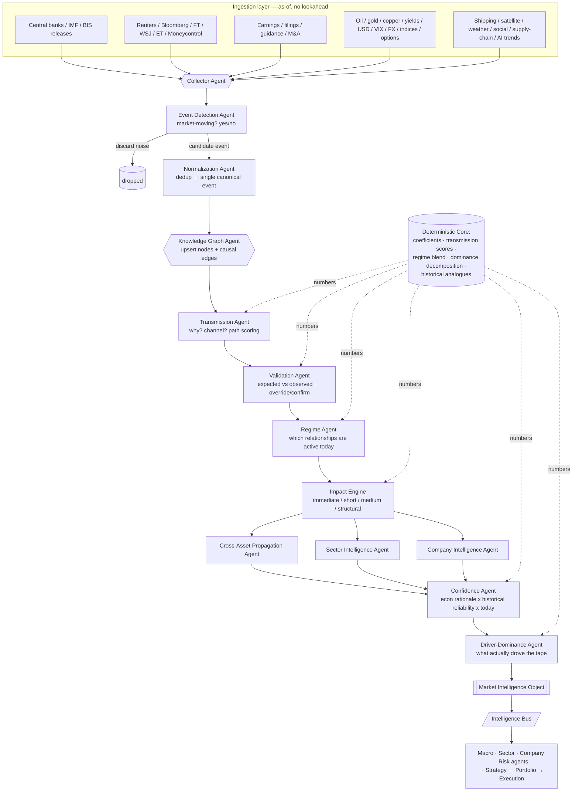

# News Intelligence Agent — Market Knowledge Graph Builder

## What it is

The News Intelligence Agent is the **top of the intelligence stack** in a multi-agent
trading platform. It continuously transforms unstructured global news, economic releases,
corporate announcements, policy decisions, market data and cross-asset movements into
**structured market intelligence** by identifying events, causal relationships,
transmission channels, affected entities, impacted sectors, market regimes, and probable
trading implications.

It is deliberately **not** a sentiment engine and **not** a news reader. Its output is a
living **causal knowledge graph** plus a stream of standardized **Market Intelligence
Objects (MIOs)** that the Macro, Sector, Company, Risk, Strategy, Portfolio and Execution
agents all consume.

**Substrate:** a *full LLM multi-agent* system — each core responsibility is an LLM agent
with a bounded toolset — orchestrated over a **Deterministic Core** that owns every number
(coefficients, transmission scores, regime blends, driver dominance). LLMs read, normalize,
reason over structure, and self-critique; the Core computes and constrains. This split is
the institutional discipline: *reasoning is delegated, arithmetic is not.*

## Data-flow diagram

## Agent roles (summary — full spec in AGENTS.md)

| Agent | Mission (one line) | Emits |
|---|---|---|
| **Collector** | Poll every structured/unstructured source as-of, stamp provenance | Raw item stream |
| **Event Detection** | Decide if an item can change market expectations | Event candidate / discard |
| **Normalization** | Collapse many headlines of one event into one canonical event | Canonical event |
| **Knowledge Graph** | Upsert entities and causal edges; the living graph | Graph delta |
| **Transmission** | Ask *why*; classify shock type; score each propagation path | Scored paths |
| **Validation** | Compare expected vs observed; record confirm / override + reason | Relationship status |
| **Regime** | Detect which relationship regime is active (Inflation, Risk-off, AI-substitution…) | Active regime set |
| **Impact Engine** | Estimate magnitude by horizon (immediate→structural), never blended | Horizoned impacts |
| **Cross-Asset Propagation** | Walk the shock through the financial system | Asset-chain effects |
| **Sector Intelligence** | Decompose to sub-sectors with per-sector transmission scores | Sector scores |
| **Company Intelligence** | Map event → company exposure vector + analogues | Company scores |
| **Confidence** | Combine econ rationale, historical reliability, today's applicability | Confidence triple |
| **Driver-Dominance** | Attribute the day's move across drivers (sums to ~1) | Dominance vector |
| **Orchestrator** | Sequence agents, own the as-of clock, assemble the MIO | MIO |

## Hard rules (do NOT regress)

1. **No lookahead.** Every agent reads only data with `ts ≤ decision_time`. Provenance and
   timestamp travel with every item; the Orchestrator owns a single as-of clock.
2. **PRIOR until calibrated.** Every transmission weight, coefficient, and reliability
   figure is tagged `PRIOR` until ≥ 60 sessions validate it (mirrors D-MA-04). Below that
   bar, numbers are **descriptive only**.
3. **Numbers come from the Core, not the LLM.** LLM agents may *propose* a magnitude only as
   a tagged hypothesis; the committed number is always computed by the Deterministic Core.
   An LLM that emits an un-sourced number is a bug.
4. **Explainability is a schema requirement.** Every MIO carries its causal chain, its
   confidence decomposition, and its driver attribution. Conclusions without a chain are
   rejected at the schema boundary.
5. **Validate, don't assume.** When observed ≠ expected, emit an **override with a reason**
   (government pricing, profit-taking, broad risk-on, stronger driver). Never "rule failed."
6. **Separate horizons.** Immediate / short / medium / structural are distinct fields.
7. **Regime-gate relationships.** An edge's sign/strength is conditioned on the active
   regime. The same SOX rally implies IT↑ under *AI-complement* and IT↓ under *AI-substitution*.
8. **One canonical event.** Three wire headlines about Hormuz are one event node, not three.
9. **Confidence, not verdict.** The atomic output unit is `(direction, confidence%)`, never
   a bare direction.

## Validation (how you'd know it works)

* **Schema conformance** — every emitted MIO validates against `schemas/mio.schema.json`;
  emission is blocked otherwise.
* **No-lookahead audit** — replay any past session; assert no agent touched a `ts >`
  decision-time record (mirrors the Strategy Desk's as-of test).
* **Normalization dedup** — a labelled set of multi-source headline clusters must collapse
  to the expected canonical-event count.
* **Override recall** — on historical days where a textbook relationship visibly broke
  (e.g. ONGC down on an oil spike), the Validation Agent must flag the override, not pass it.
* **Dominance sanity** — driver-dominance vectors sum to ≈ 1.0 and, on single-catalyst days,
  concentrate on the correct driver.
* **Backtestable reliability** — each recurring edge accrues a historical hit-rate;
  reliability shown to downstream agents is the calibrated number once ≥ 60 sessions exist.

## Relationship to the existing project

The parent `newsindex/` project already contains a deterministic engine (`market_scan.py`:
causal engine, transmission map, cause→effect scorecard, oil-regime tables, AI-regime
detection, driver dominance). In this blueprint that engine is the natural **Deterministic
Core**. The LLM agents here are the *reasoning and structure layer* wrapped around it — they
turn a single-shot daily report into a continuously-updated knowledge graph plus a
standardized object stream. See `ARCHITECTURE.md` §"Deterministic Core" for the adapter map.
