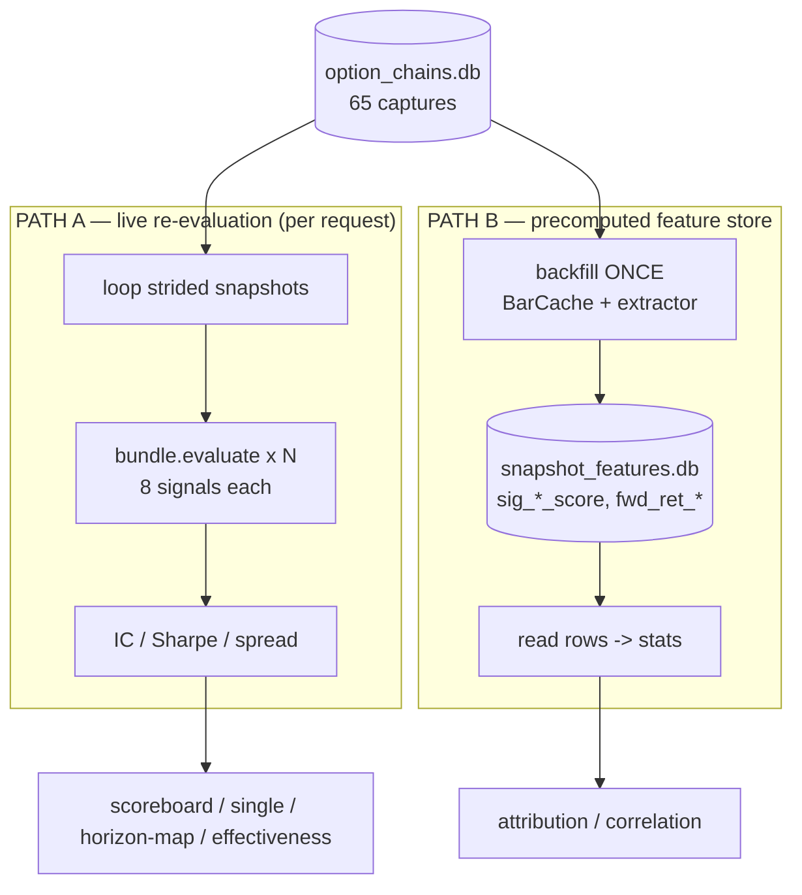

# NIFTY Options Strategy Framework — Architecture & Performance Notes

*Purpose of this doc: lay out how data flows through the system and where the
compute actually goes, so you can decide whether to optimise — and if so, what.
Short answer up front: **at today's data scale you do not need to optimise for
speed or memory. There is one structural redundancy worth fixing for
correctness and future scale, not for current latency.** Details below.*

---

## 1. Layers

The framework is ~2,800 lines of Python plus a React panel. It sits **on top of**
the existing `backend/` app and reads its SQLite DB; it does not own the data.

| Layer | Where | Job |
|---|---|---|
| **Read layer** | `signals/data_access.py` | Single audited path to `option_chains.db`. Every read is a backward as-of join keyed on a decision time `now` — this is what guarantees *no lookahead* (D-MA-01). Also holds `BarCache`. |
| **Signals** | `signals/*.py` | Each turns the chain + bars as-of `now` into a `(score ∈ [-1,1], confidence, status)`. `bundle.evaluate()` runs them for one timestamp. Cross-signal math lives once and is imported, not re-implemented — e.g. index-volume reconstruction (`Σ index_weightᵢ × volumeᵢ` per bar, since the NIFTY index bar carries volume=0) is the single canonical `signals/index_volume.py::per_bar_index_volume`, shared by `technical_momentum` / `vwap` / `rel_volume` (a de-duplication: the three previously each rolled their own identical loop). |
| **Strategy** | `strategy/*.py` | Regime classifier → candidate structures → constructor → adjustment engine (roll/defend/convert/stop). |
| **Backtest** | `backtest/*.py` | Walk-forward replay of a structure with ₹20/leg costs and the adjustment engine. |
| **Feature store** | `features/store.py` + `extractor.py` | Precomputes, per snapshot, a flat JSON row: all signal scores, chain stats (RND, smile, OI, PCR, max-pain), market state, and **forward-return outcome labels**. Lives in a *sibling* `snapshot_features.db`. |
| **Facade** | `api.py` (884 lines) | Every UI action is one function here. Owns the two background-job dicts (`_BF` backfill, `_ST` signal-test). |
| **HTTP** | `backend/main.py` `/api/strategy/*` | Thin FastAPI wrappers over the facade. |
| **UI** | `src/components/*.tsx` | Desk (portfolio/backtest/simulate) + Signal Test (scoreboard, single, attribution, correlation, horizon map). |

---

## 2. Data stores (measured, current DB)

`option_chains.db` is **1.3 MB**. The framework touches:

| Table | Rows | Used by |
|---|---:|---|
| `captures` | 65 | every analytic (the snapshot spine) |
| `chain_rows` | 715 | chain-as-of, skew/RND, OI, VRP |
| `price_bars` | 5,161 | technical & global momentum, breadth |
| `minute_bars` | **0** | *(empty)* |
| `nifty_daily_prices` | **0** | *(empty)* |
| `global_cues` | **0** | *(empty)* — global-momentum falls back |
| `realized_metrics` | **0** | *(empty)* — VRP realised leg falls back |
| `instruments` | 1 | symbol registry |

**Feature store** (`snapshot_features.db`): one JSON blob per `(ts, expiry)`.
At 65 captures that is 65 rows / a few hundred KB.

Two things to notice: several cross-asset tables are **empty**, so some signals
are running on fallbacks (not a perf issue, a *data-coverage* issue); and the
whole dataset is tiny — kilobytes-to-low-megabytes, one completed expiry.

---

## 3. The two compute paths (this is the crux)

There are **two independent ways** the same numbers get produced, and this is the
only thing in the design worth a decision.

**Path A (live):** `signal_backtest_all`, `signal_backtest`,
`signal_horizon_curve`, and the new `signal_effectiveness` all loop over ~65–160
strided snapshots and call `bundle.evaluate()` **fresh each time**. Note these
calls **do not pass `BarCache`** — so within one run, every signal re-queries the
bars table. This is the classic N+1 the backfill already solved, but the
analytics endpoints never adopted it.

**Path B (precomputed):** `attribution` and `signal_correlation` read the feature
store, where `sig_*_score` and `fwd_ret_*` were computed **once** at backfill
(and *that* path uses `BarCache`). These are effectively instant.

So the redundancy is: **Path A recomputes, on every button press, numbers Path B
already has on disk.** The horizon map, scoreboard, and single-signal views could
all be served from the feature store rows instead of re-evaluating the bundle.

---

## 4. Cost model — where the time goes

Let **N** = sampled snapshots (≤160), **S** = 8 signals, **B** = bars scanned.

| Operation | Complexity | Today | Dominated by |
|---|---|---|---|
| One `bundle.evaluate` | O(S · bar-read) | ~20–60 ms | per-signal bar queries (no cache) |
| Path A analytic (a run) | O(N · S · bar-read) | ~1–4 s | repeated evaluate |
| Backfill (once) | O(N · S) with BarCache | ~1–3 s | one-time |
| Path B analytic | O(rows) memory | <50 ms | JSON parse |
| Correlation / attribution | O(rows · pairs) | <100 ms | numpy on ≤160 rows |

The only thing a user *waits* on is a Path-A run, and it's seconds — which is
exactly why the progress bar was added. Memory is a non-issue: the scoped
`BarCache` holds one expiry window of `price_bars` (a few thousand rows) and the
feature store is a few hundred KB.

---

## 5. Should you optimise? (time / data)

**For today's scale: no.** 65 captures, 1.3 MB, one expiry. Runs are seconds,
RAM is megabytes. Micro-optimising SQL or vectorising further would be effort
spent on a problem you don't have. The correct engineering call now is to leave
speed alone.

**The one change worth making is architectural, not performance:** make the
**feature store the single source of truth** and have Path-A analytics read
`sig_*_score` + `fwd_ret_*` from it instead of re-evaluating the bundle. Benefits,
in priority order:

1. **Consistency** — scoreboard/horizon-map and attribution/correlation would
   compute from *identical* numbers. Right now a live re-eval can drift from the
   stored value if a signal's code changed since the last backfill.
2. **Speed for free** — Path-A runs collapse from seconds to <100 ms; the progress
   bar becomes almost unnecessary.
3. **Scale headroom** — when you add more expiries / denser captures, live
   re-eval grows O(N·S) *per request* while store-reads grow O(rows) *once*.

The cost of that change: analytics can only test what's been backfilled, so
"add a new signal" now requires a rebuild before it shows in the scoreboard
(already true for attribution/correlation — you added the *rebuild all*
checkbox for exactly this). That's an acceptable trade.

**When speed *would* matter (thresholds to watch):**

- More than a few thousand captures, or many expiries pooled together → Path-A
  seconds become tens of seconds. Move to store-reads before then.
- Denser than ~1-minute capture cadence → the horizon map can finally resolve
  5m/15m/30m separately (today they're identical because captures are coarser
  than 5 min), and bar volume grows — BarCache stays fine, live re-eval doesn't.

**Data (not time) is the real lever right now.** The empty `global_cues`,
`minute_bars`, `realized_metrics` tables mean global-momentum and VRP are on
fallbacks, and IV is solved from LTP because the feed stores IV=0. Filling those
would improve *signal quality* far more than any speed optimisation would improve
*experience*.

---

## 6. Recommended next steps (if you choose to act)

1. **Unify on the store** — add a `source="store"` fast path to
   `signal_backtest_all` / `signal_effectiveness` that reads `sig_*_score` and
   `fwd_ret_*` from the feature store when a backfill exists, falling back to live
   eval when it doesn't. One code change, big consistency + speed win, zero risk
   at current scale.
2. **Pool across expiries** — the horizon map and correlation over *all* completed
   expiries with a per-cell sign-stability marker, so you can tell a real
   time-scale from a one-window fluke. This is a *data-coverage* win and only
   becomes practical once Step 1 makes multi-expiry reads cheap.
3. **Backfill the empty tables** (global cues, realised vol) to take signals off
   their fallbacks.

Speed optimisation is deliberately **not** on this list — it isn't needed yet,
and Step 1 delivers it as a side effect.
