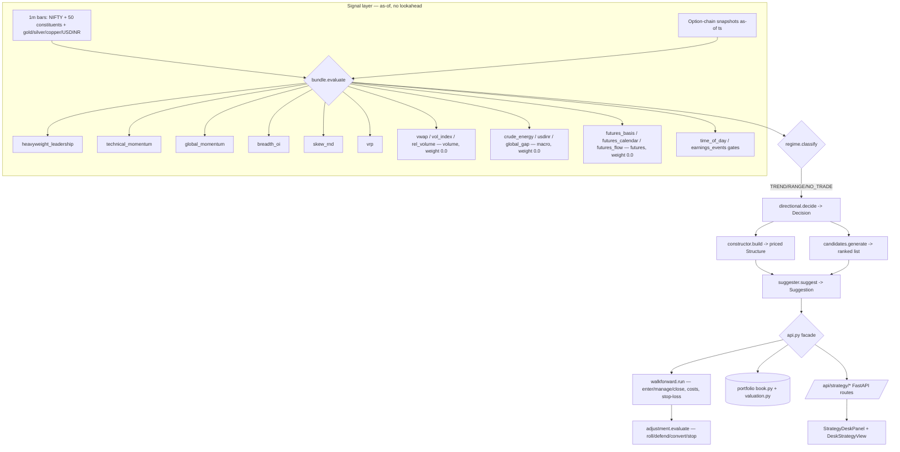

# NiftyOptions Strategy Desk Framework

## What it is
The Strategy Desk framework is an orchestration layer on top of the existing quant
engine. It turns the minute-level signals into a **directional-momentum options
strategy suggestion on the NIFTY index**, and **walk-forward backtests** it. It
classifies the market into a regime (TREND / RANGE / NO_TRADE), picks an options
structure to fit (directional spreads, long options, iron condor/butterfly),
manages the position as the market moves (roll / defend / convert / stop-loss),
and accounts for ₹20/leg transaction costs. It also holds a mixed-instrument
portfolio (option strategies + futures + stocks) for combined P&L.

**Crucially, it is a RELATIVE decision-support tool, not a calibrated edge
predictor.** Every uncalibrated threshold ships tagged `PRIOR` and every backtest
metric is tagged "descriptive only" until ≥60 sessions of history exist (D-MA-04).
It reuses the project's engines (rnd.py, skew, global_cues, flows, sector_map)
rather than duplicating them.

## Data-Flow Diagram

## Module Roles

### `signals/`
* **`data_access.py`**: The only DB read surface. Backward as-of joins (D-MA-01) so a snapshot stamped T is visible only to decisions at/after T. Takes an explicit DB path (test DB / sandbox / live Drive copy). One connection per call.
* **`base.py`**: The `Signal` contract (`score∈[-1,1]`, `confidence∈[0,1]`, `tag`, `detail`) and `SignalBundle`.
* **`index_volume.py`**: `per_bar_index_volume(da, ts_list) -> (weighted, unweighted, n_used)` — the SINGLE canonical home for reconstructing the NIFTY per-minute index volume from constituents (`Σ index_weightᵢ × volumeᵢ` per bar; the raw NIFTY index bar carries volume=0). Imported by `technical_momentum`, `vwap`, `rel_volume` (see HARD RULE 12). `vol_index` deliberately does NOT use it — it weights per-stock RETURNS by weight×volume, a different computation.
* **`heavyweight_leadership.py`**: Weights the 50 constituents by free-float index weight → the ground-truth tape. Detects volume-backed heavyweight leadership and sector rotation. Highest-weight signal.
* **`technical_momentum.py`**: NIFTY 1m EMA trend + windowed thrust + volume-building participation. Falls back to `per_bar_index_volume` when the NIFTY bar has no volume, so its volume/participation arm is live instead of silently inert; reports `detail.vol_source` ("nifty_bar" / "constituents(N)").
* **`global_momentum.py`**: Metals barometer (copper−gold) + USDINR forex tilt + session drift. Prefers `global_cues_cache.json`.
* **`breadth_oi.py`**: Constituent advance/decline (**index-weighted** + equal-weighted; score uses weighted, since index direction is cap-weighted) + put/call OI walls (support/resistance) and their reinforcement.
* **`skew_rnd.py`**: RND mean-drift vs spot (via `backend/quant/rnd.py` when scipy present) + 25Δ risk-reversal, else a premium proxy.
* **`vrp.py`**: IV-vs-realized-vol ratio (D-MA-03). Mostly a structure modulator (RICH → sell premium, CHEAP → buy).
* **`vwap.py`** / **`vol_index.py`** / **`rel_volume.py`** (volume, **weight 0.0**): all **index-weighted** (NIFTY is cap-weighted; a heavyweight's price/volume counts more), reporting weighted + unweighted variants. The index carries no volume, so per-minute market volume is **estimated from constituents**. (1) spot vs **session VWAP** (resets 09:15 IST) + slope, above = bullish, TWAP only if no volume; (2) **index-weight × volume momentum** `Σ(wᵢ·volᵢ·retᵢ)/Σ(wᵢ·volᵢ)` with index-/volume-weighted divergence; (3) NIFTY direction **scaled by (index-weighted) relative volume**. NO_DATA-safe. `vwap` + `rel_volume` import the shared `per_bar_index_volume` for the constituent-volume reconstruction; `vol_index` does not (different math — see HARD RULE 12).
* **`crude_energy.py`** / **`usdinr.py`** / **`global_gap.py`** (macro / risk-off, **weight 0.0**): read `CRUDEOIL` / `USDINR` / `GIFTNIFTY` from `price_bars` (no separate `global_cues` table — the commodity/FX sync writes there). Sign: crude up = bearish, USDINR up (rupee weak) = bearish, GIFT above spot = bullish next session (the one forward/overnight read; confidence decays after open). See `MACRO_SIGNALS_SPEC.md`.
* **`futures_basis.py`** / **`futures_calendar.py`** / **`futures_flow.py`** (NIFTY futures, **weight 0.0**): read `NIFTY_FUT_1` (near) / `NIFTY_FUT_2` (far) / `NIFTY` spot from `price_bars` (exchange NFO). The positioning + real-volume layer the cash-tape signals miss. **basis** = near−spot (premium expanding = bullish, discount = bearish — the hedging/panic tell); **calendar** = far−near term structure (steepening contango = bullish, backwardation = bearish); **flow** = the future's own price move × its **REAL traded volume** (the only true NIFTY-level volume; cash index has none, so `rel_volume` only estimates it). Schema is OHLCV, no OI — so no OI-based long/short-buildup or rollover; volume feeds confidence only. See `MACRO_SIGNALS_SPEC.md`.
* All six weight-0.0 signals are computed + stored (`sig_*_score`) and shown in every Signal Test view, but excluded from the trade blend until validated — raise the weight in `config/settings.py` once the Horizon map / Attribution prove edge ("evaluate before you trust").
* **`time_of_day.py`**: IST session phase. Opening/power-hour amplify momentum confidence; expiry-close flags pin risk.
* **`earnings_events.py`**: Event/earnings veto within the window (not directional).
* **`bundle.py`**: Evaluates every signal as-of one timestamp.

### `strategy/`
* **`regime.py`**: Confidence-weighted blend (time-of-day amplified) → TREND_UP / TREND_DOWN / RANGE / NO_TRADE, plus an expected-move estimate.
* **`directional.py`**: Wraps the regime into a `Decision`. **Cost-edge gate** (opt-in, after Salov's Maximum Profit Strategy): `decide()` takes optional `costs` / `lot_size`; when `Gates.min_edge_cost_mult > 0` it flips a would-be trade from ACT → STAND_ASIDE if the expected 1σ move (₹/lot) is below `mult ×` the structure's round-trip cost. The `Decision` carries `edge_ratio` / `edge_cost_mult` / `cost_gated`. Default 0.0 = OFF. PRIOR / descriptive.
* **`constructor.py`**: Family → priced legs `(side,strike,sign)` + payoff curve. Verticals, condor, butterfly, straddle, strangle, long options. Iron-condor shorts placed ~1σ (expected move) OTM (`condor_short_em_mult`), OI wall only as a tiebreaker within tolerance — so shorts aren't near-ATM at longer DTE. `from_legs()` prices arbitrary leg sets (used by adjustments). Rejects degenerate structures.
* **`candidates.py`**: Ranked list of priced candidate structures for the current lean — shown even when the gate says NO_TRADE.
* **`adjustment.py`**: Manages an open position like a desk. A strong *confirmed* trend → `CONVERT_TO_VERTICAL` (drop the tested/losing wing, keep the untested/winning wing as a directional credit spread) rather than rolling the whole condor into the move (the anti-gamma-chase fix). Moderate lean → wing-level `ROLL_UNTESTED_TOWARD` / `DEFEND_TESTED`; opt-in `HARVEST_WING` collects fresh premium on the over-safe wing in a trend if it clears cost. **Discipline gates**: cooldown (min minutes between adjustments), persistence (breach must confirm), max-adjustments budget (a **fee** limit, not a risk limit — once spent it holds and lets the **stop-loss** own the exit, or `EXIT`s if no stop). Band-edge guard rejects spread-collapsing rolls. All tunable per run.
* **`suggester.py`**: Top-level `suggest()` → decision + primary structure + ranked candidates + signals.

#### Forecast-driven management (the optimizer layer)
The prediction model answers *"what is likely to happen?"* (expected move, confidence, σ); a separate **optimizer** answers *"given that forecast and my current position, what should I do?"*. Kept deliberately separate ("Google Maps predicts traffic, it doesn't pick the car").
* **`risk_forecast.py`**: Turns the regime forecast (drift = `net_score × expected_move`, σ) into forward-looking probabilities. Closed-form first-passage **touch** / **expiry-breach** (reflection principle, no Monte Carlo) and `pnl_under_forecast(grid, payoff, …)` — integrates any payoff curve against the terminal-spot distribution N(spot+drift, σ) → `{expected, cvar10, std, p_loss}`. The shared substrate for both optimizers below.
* **`action_eval.py`** (OPTIONS): scores {HOLD, DEFEND_PUT, DEFEND_CALL, HARVEST_WING, CLOSE} for a condor/strangle by the tail-aware objective **`score = E[P&L] − λ·|CVaR10|`** (λ default 0.5). HOLD is scored on its own merit (not a bare 0); an action must beat HOLD by `min_edge` to be recommended (churn guard). **Harvest is state-aware**: cumulative `harvest_debt_pts` (protection sold away) carries a soft penalty PLUS an optional hard budget (`max_harvests` / `max_harvest_debt` / `min_wing_buffer`) — so a one-step optimizer can see the multi-step over-harvesting problem. `risk_drift_frac` knob: 1.0 = trend-centred tail, 0.0 = symmetric tail (prices a reversal, values the far wing as insurance).
* **`futures_action_eval.py`** (FUTURES, linear): scores {HOLD, EXIT, ADD, REDUCE, REVERSE} for a signed position by the SAME `E − λ·|CVaR10|`. A future's payoff is linear (`q·(S_T−S₀)·lot`), integrated against the forecast distribution. EXIT is "realized" (flat forward, zero variance). Empirical finding: a lone NIFTY future has a large tail (σ≈60pts×65) vs its directional edge, so at λ=0.5 the optimizer is reluctant to hold naked and prefers flat unless conviction is high — it ADDs to a strong-up forecast only at λ≲0.3 or a shorter horizon. This is the objective working, not a bug; two knobs govern it (λ, `risk_drift_frac`). Wired into the futures backtest **advisory-only** (logs would-do + a shadow "would-be" equity; recorded P&L stays the plain 1-lot path) — "evaluate before you trust".

#### Drawdown-insurance & macro overlays
* **`derisk_liquidity.py`**: Coincident liquidity-derisk intensity (0..1) from volume/vol/breadth stress — the max-drawdown-insurance trigger.
* **`derisk_preopen.py`**: LEADING pre-open detector (runs ~03:44Z / 09:14 IST) reading GIFT-Nifty gap + overnight crude/USD — the "foreseeable overnight gap" verdict (ARMED vs CLEAR).
* **tail hedge** (`constructor.build_tail_hedge`): long OTM put sized by intensity, strike between `sigma_lo`/`sigma_hi`×EM, optional cost-reduced put-spread reference (`HedgeConfig`).
* **macro-shock cause & effect** (in `api.py` + backend): trigger detection, cross-asset roles (gold haven-failure / USD magnet / copper growth), transmission chain, sector expected-vs-observed (producer/refiner split), breadth, and **shock-timing classification** (overnight-gap-with-tell / no-tell / intraday-developing) with a pre-open derisk verdict.

### `backtest/`
* **`walkforward.py`**: Event-driven, no-lookahead engine. Enters at strided snapshots, holds/manages, marks P&L leg-by-leg, charges ₹20/leg. Exit modes: horizon / expiry / manage. Management is **strided across the whole window** (all sessions covered, `max_manage` = monitoring resolution). Bracketed exits: **take-profit** (% of max credit) and **stop-loss** (auto or user-set ₹). A still-live expiry ends in a provisional **MARK** (not SETTLE). Scoped BarCache for speed.
* **`portfolio_bt.py`**: Marks the assembled book forward through history (the "My book" mode).
* **`metrics.py`**: Honest, cost-net summary stats (gross/cost/net, hit rate, drawdown), always caveated. **MPS0 benchmark**: `mps0_max_profit(prices, flip_cost_inr, lot_size)` computes a perfect-hindsight reversal-strategy ceiling via an O(n) two-state DP; `summarize()` optionally returns `mps0_max_rupees` + `capture_pct` (realised net ÷ ceiling). `walkforward.run` gains `mps_benchmark` ("off" / "gross" = zero-cost ceiling / "net" = charge the desk's avg round-trip cost); the price path is sampled at the strategy's ENTRY CADENCE (stride) so capture % is comparable. A ceiling / skill score, NOT a target — descriptive only.

### `portfolio/` — the Desk Book
* **`book.py`**: Mixed book — **option strategies + futures + stocks** — persisted to `.state/strategy_desk_portfolio.json`. Each position carries `exchange` + `expiry`; options price their legs from the chain at add time (so entry ≠ ₹0). Add positions by hand (long/short put/call, condor/butterfly, future, stock-with-exchange) OR push a strike-adjusted structure straight from the Directional Suggester ("Add to Desk Book"). Pick any one position to backtest.
* **futures series**: the DB holds two real NIFTY futures series — **`NIFTY_FUT_1`** (near) and **`NIFTY_FUT_2`** (next) — with MONTHLY (last-Thursday) expiries resolved by rank (near = 2026-07-30, next = 2026-08-27, rolling). A future backtest walks the series' OWN 1m price bars linearly (not spot); `instruments_meta()` discovers these + the tradable stock symbols + exchanges + lot size from the DB for the data-driven Desk Book dropdowns. Futures expiry ≠ option expiry (options are weekly+monthly).
* **`valuation.py`**: Marks the book to price → per-position + combined P&L, net delta (₹/index-point).
* **`context.py`**: Pricing context: live feed → latest-capture fallback.

### `config/`
* **`settings.py`**: Signal weights, gates, strike prefs, ₹/leg costs, DB resolution. All tunable, all tagged `PRIOR`. `global_momentum` weight is **0.0** (no data → NO_DATA): the score blend self-normalises over live signals, but `net_confidence` divides by the FIXED sum of ALL weights, so leaving a dead signal at non-zero weight silently deflates confidence and spuriously triggers NO_TRADE — the six core weights therefore sum to 0.82, which is fine because the blend normalises. `Gates.min_edge_cost_mult` (default 0.0 = OFF) drives the cost-edge gate.
* **`constituents.py`**: Symbol-keyed NIFTY-50 index weights + sectors (from `nifty-50-stock-list.csv`).

### `features/`
* **`extractor.py`**: The as-of feature vector for `(ts, expiry)` — signal scores (+ `sig_*_ok` status flags), RND/smile/solved-IV, OI/max-pain/PCR, market state (VWAP, realised vol, `vix_regime`), and **forward-return outcome labels**. IV solved from LTP via `bs.py` (feed stores IV=0).
* **`store.py`**: `snapshot_features.db` (sibling DB, honours `NIFTY_FEATURES_DB`). `backfill(force=…, progress_cb=…)` — incremental (only new snapshots), scoped negative-caching BarCache that pre-loads constituents + cross-asset/macro symbols so signals don't hit SQLite per snapshot. `query`, `clear`. The analytics read scores from here ("compute once, read many") and fall back to live evaluation for missing snapshots.

### `api.py`
Thin facade the FastAPI `/api/strategy/*` routes call: `suggest`, `backtest`, `simulate` (with take-profit / stop-loss / adjustment-discipline / harvest / `proactive` optimizer / `max_manage` knobs), the **Signal Test** analytics (`signal_backtest`, `signal_backtest_all`, `signal_effectiveness` with a feature-store fast path, `signal_horizon_curve`, `attribution`, `signal_correlation`), `features_backfill(_start/_status)`, and portfolio/candidate CRUD. New this cycle: `instruments_meta` (data-driven Desk Book dropdowns), `backtest_book_position` (routes by kind → option / linear-future-series / stock; advisory optimizer in Manage mode), `simulate_compare` + `compare_harvest` (the A/B/C/D harvest experiment), `futures_action_score` (`/api/strategy/futures-action` — point-in-time HOLD/EXIT/ADD/REDUCE/REVERSE table), `drawdown_insurance`, and the macro-shock endpoint. `suggest` / `backtest` also take `min_edge_cost_mult` (cost-edge gate) and `backtest` takes `mps_benchmark` (MPS0 max-profit ceiling), both surfaced as desk dropdowns. Background jobs (`_ST`, `_BF`) drive the progress bars.

### The A/B/C/D harvest experiment
Four condor management strategies run on the same entry to isolate whether rolling **over-harvests**: **A** always-harvest, **B** never, **C** optimizer-gated (VETO a rule HARVEST if `action_eval` disagrees), **D** optimizer + hard budget. Shared regime/suggestion/bar caches make the 4 runs ≈1× cost. Empirically confirmed the hypothesis (A worse net + drawdown; the optimizer vetoed every harvest, matching never-harvest). Note the A/B/C/D framing is **condor-specific** — a linear future has no wings to harvest, so all four collapse to the same path; use the futures optimizer instead.

## HARD RULES (Do NOT regress these invariants)
1. **No lookahead.** Every signal and every backtest mark reads data with `ts <= now` via the as-of joins in `data_access.py` (D-MA-01). Never read a bar or snapshot stamped after the decision time.
2. **PRIOR until calibrated.** Every weight/gate/threshold is a judgement prior tagged `PRIOR` until ≥60 sessions of history exist (D-MA-04). Backtest metrics are "descriptive only" below that bar — never present them as validated edge.
3. **Costs are always charged.** ₹20/leg on entry, exit, and every adjustment, in all exit modes. P&L is reported net of costs.
4. **The gate governs execution, not visibility.** `candidates.generate` always returns priced options for the current lean even when the gate is NO_TRADE. Do not blank the desk.
5. **Reuse, don't duplicate.** Signal math comes from the existing engines (`rnd.py`, `skew/`, `global_cues.py`, `flows.py`, `sector_map.py`) where they exist. Heavy deps (scipy/sklearn) are optional imports with numpy fallbacks.
6. **Window = trading sessions.** The backtest window is N *session days* (distinct capture dates incl. expiry), not calendar days — holidays/weekends are skipped because they have no data.
7. **Timestamps are UTC in the DB, IST at the UI boundary.** Convert (+5:30) only for display.
8. **Analytics are single-expiry.** Every backtest/analytic runs on ONE expiry (an Expiry dropdown selects it; blank → most recent *completed* via `_backtest_default_expiry`). "Session days" trims sessions *within* that expiry — it is NOT cross-expiry pooling. A still-live (future) expiry can't settle, so its final row is a provisional `MARK`, not `SETTLE`. Cross-expiry pooling is a NEXT_STEPS item.
9. **Lot size = 65** (`LOT_SIZE`, `config/settings.py`), revised from 75 effective 1-Jan-2026. Use 75 only for pre-2026 backtests. Contract value = 65 × index.
10. **Futures expiry ≠ option expiry.** Futures expire MONTHLY (last Thursday); options weekly+monthly. The Desk Book add-form uses the LIVE exchange calendar (`/api/exchange-expiries`, past expiries excluded) while the Backtest selector keeps completed expiries for replay. When the chosen structure is a future the shared expiry selector shows the two futures CONTRACTS (`NIFTY_FUT_1`/`_2`), not option expiries.
11. **Optimizer is advisory-first.** New forecast-driven action optimizers (options + futures) log what they WOULD do and a shadow would-be equity; recorded P&L stays the plain path until each is validated. Never promote to execution silently.
12. **Single source of truth — CHECK BEFORE YOU WRITE A HELPER.** Before adding any helper/utility, grep the codebase for equivalent logic first. If similar code already exists, extract it into ONE canonical module and import it everywhere — never copy-paste or re-implement. Cross-signal utilities live in exactly one place, e.g. index-volume reconstruction (`Σ index_weightᵢ × volumeᵢ` per bar) lives ONLY in `signals/index_volume.py` (`per_bar_index_volume`), imported by technical_momentum / vwap / rel_volume. If a signal legitimately needs a *different* computation (e.g. `vol_index` weights per-stock returns), say so in a comment stating why it is not a duplicate.
13. **One signal registry.** Every signal is declared exactly ONCE in `signals/registry.py` — a `SignalSpec` carrying its name, `compute` fn, **family**, default weight, `kind` (directional / gate / overlay), and the `blended` / `momentum_boost` flags. The bundle (what to compute), the regime blend (`_DIRECTIONAL` / `_MOMENTUM_FAMILY`), `SignalWeights` (default weights + roster), the analytics roster (`api._DIR_SIGNAL_NAMES`, `walkforward._DIR_SIGNALS`) and the signal-study tool ALL derive from it. **Never hardcode a signal list or weight roster anywhere else.** Adding a signal = write its `compute(da, now, ctx)` module in `signals/` + add ONE SignalSpec row; it flows everywhere automatically.

## Validation
* `python -m pytest strategy_framework/tests/ -q` — payoff math, no-lookahead as-of joins, adjustment discipline (convert/cooldown/persistence/budget/harvest), cost model, valuation (26 tests).
* `python strategy_framework/run_demo.py suggest | backtest | expiries` — CLI smoke test.
